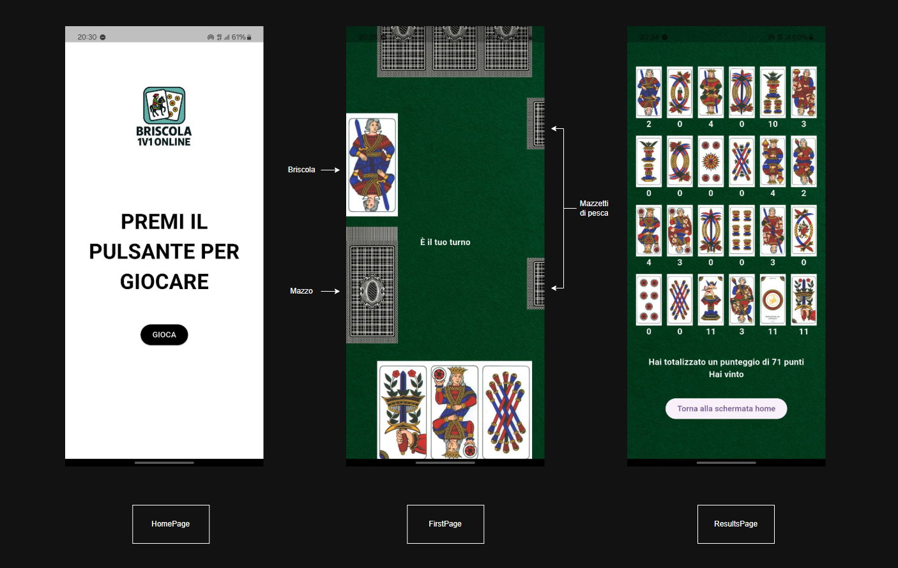

# Briscola

Briscola Online 1v1
Sfida i tuoi amici a briscola in partite 1 vs 1.

## Mazzo di carte

Il mazzo di briscola si compone di 40 carte, 10 per ognuno dei seguenti semi:

* Bastoni
* Spade
* Coppe
* Denari

Qui di seguito un'immagine con tutte le carte in ordine


## Svolgimento del gioco

All'inizio della partita verranno disposte sul campo da gioco le 40 carte del [Mazzo di carte](#mazzo-di-carte) e verrà estratta la prima carta che sarà la Briscola.
Dopodiché verrà scelto casualmente il giocatore che inizierà per primo e verrano dsitribuite 3 carte a ciascuno.
Da questo momento inizia il gioco vero e proprio che si compone di turni che si svolgono in questi passaggi:

* Il primo giocatore gioca una carta premendola
* Il secondo giocatore risponde con una carta
* Avviene il confronto seguendo le [Regole di confronto](#Regole-di-confronto) per decidere chi vince il turno
* Il vincitore aggiunge al proprio mazzetto le carte giocate e ne ottiene il punteggio
* Il giocatore che ha vinto il turno pesca una carta dal mazzo
* Il giocatore che ha perso il turno pesca di conseguenza
* Si rigioca un nuovo turno
* Quando in campo sono rimaste solamente una carta del mazzo e la briscola, il vincitore del turno pesca l'ultima carta del mazzo e il perdente la briscola, dopodiché si svolgono gli ultimi turni senza pescare carte.

Alla fine della partita verranno mostrati i risultati con l'elenco delle carte ottenute, il loro punteggio e il punteggio finale.

## Regole di confronto

Se il primo giocatore che gioca una carta gioca carta1 e il secondo gioca carta2:

* Se carta1 è dello stesso seme di carta2, vince la carta con il punteggo più alto
* Se carta1 è dello stesso seme di carta2 e hanno lo stesso punteggio, vince la carta con il valore più alto
* Se le carte sono di semi diversi ma una di loro è dello stesso seme della briscola, vince quest'ultima
* Se le carte sono di semi diversi prevale il seme di carta1, quindi per qualsiasi carta2 di seme diverso vince carta1

## Screenshots del gioco


## Scelte di sviluppo

Il progetto si compone di un WebSocket server (nella cartella "briscola") e di un client che comunicano tramite WebSockets.
Il server conta quanti client si connettono e gli assegna a due a due una sessione di gioco.
Server e client comunicano tramite un continuo scambio di messaggi:

* Il server invia "init" che dice ai client di inizializzare il tabellone
* Al termine dell'inizializzazione i client rispondono con "initialized"
* Il server invia "discover briscola" con il seme e valore della briscola
* I client rispondono con "briscola discovered"
* Il server invia "draw cards" con i dati delle carte pescate a ciascun client
* I client rispondono con "cards drawed"
* Il server comunica a chi di dovere "your turn"
* Il client a cui tocca giocare risponde con la carta giocata
* Il server passa il turno e comunica ai rispettivi giocatori la carta giocata dall'avversario
* Quando entrambi i client hanno giocato il server comunica "round won" o "round lost"
* I client rispondono con "confront received"
* Il server invia "draw a card" a ciascun client con i dettagli della carta pescata
* E così via fino alla fine della partita (fatta eccezione per l'ultimo round in cui viene mandato un messaggio diverso perché uno dei client dovrà pescare la briscola e per gli ultimi round in cui non si deve pescare la carta)

La logica di gioco è gestita interamente dal server, perciò solo lui conosce le carte del mazzo, la briscola e le carte giocate da ciascuno giocatore. È stato scelto questo approccio per minimizzare la possibilità di barare.

L'applicazione client si compone di 3 pagine:

* La HomePage che contiene il pulsante "Gioca" che indirizza alla FirstPage
* La FirstPage in cui avviene la ricerca dell'avversario e il gioco vero e proprio
* La ResultsPage a cui si viene indirizzati automaticamente alla fine della partita

## Alcune precisazioni sulla connettività al server

In questa versione, non potendo disporre di un indirizzo ip statico, i client si connettono al server che si trova all'indirizzo 192.168.151.210/24.
Ne consegue che se si volesse far girare l'applicazione su reti diverse, o semplicemente usare un server a un indirizzo differente, è necessario modificare manualmente l'indirizzo a cui i client si collegnao scaricando il progetto come spiegato nelle prossime sezioni.

## Requisiti

- Flutter SDK
- Android Studio
- Visual Studio Code

L'ambiente deve essere configurato correttamente, il seguente comando da digitare sul prompt dei comandi fornirà indicazioni sullo stato configurazione:
```bash
flutter doctor
```

## Download del progetto

È possibile scaricare questo progetto selezionando il percorso desiderato dal prompt dei comandi e digitando:
```bash
git clone https://github.com/LeoF-07/Briscola.git
```
L' applicazione client funziona per i dispositivi Android.
Se i [Requisiti](#Requisiti) sono rispettati sarà possibile modificare il progetto con Android Studio o Visual Studio Code ed emularlo.


## Emulazione dell'applicazione

L'emulazione dell'applicazione può avvenire o con i dispositivi virtuali che Android Studio mette a disposizione oppure su un dispositivi fisico personale. Se si sceglie di eseguire il debug con questa seconda opzione è necessario seguire questi passaggi:
1. Collegare il dispositivo al PC tramite un cavo USB.
2. Assicurarsi che il **debug USB** sia attivo nelle Opzioni sviluppatore del dispositivo Android.
3. Verificare che il dispositivo sia riconosciuto e ottenere l'id del dispositivo con:
```bash
futter devices
```
4. Digitare nel prompt dei comandi all'interno della cartella del progetto:
```bash
flutter run -d <device-id>
```

## Creazione APK

L'APK può essere creato direttamente del Menu di Android Studio nella sezione Build, oppure è sufficiente digitare questo comando nel prompt dei comandi all'interno della cartella del progetto:
```bash
flutter build apk --release
```

Nella sezione [Releases](https://github.com/LeoF-07/Briscola/releases) della repository è presente l'APK da scaricare senza bisogno di aprire il progetto con un IDE.


Trasferendo l'apk su un dispositivo Android potrà essere scaricato e l'applicazione sarà pronta all'uso.


## Autore

Leonardo Fortin
